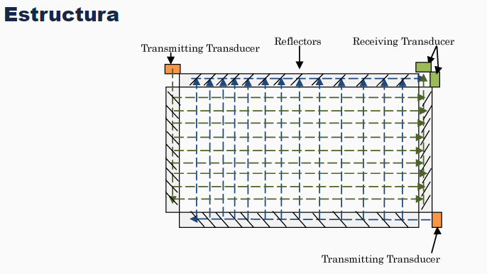
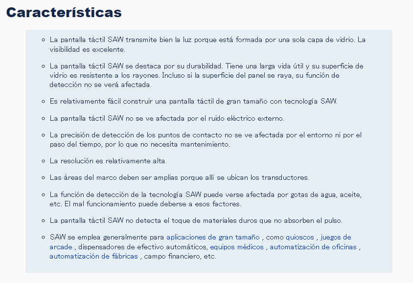

## Ejercicio N° 1.4

## ¿Qué tecnología se podría utilizar para hacer una pantalla gigante táctil? (SAW)

La tecnología **Surface Acoustic Wave (SAW)** es una de las más utilizadas para la fabricación de pantallas táctiles, especialmente en pantallas de gran tamaño.  

### ¿Cómo funciona SAW?

- **SAW** se basa en la transmisión de ondas acústicas a través de la superficie de un vidrio. Este vidrio está cubierto con una malla de sensores que detectan las ondas acústicas. Cuando un usuario toca la pantalla, el toque interfiere con las ondas, y los sensores en el borde de la pantalla registran el cambio en las ondas.
- Las ondas acústicas viajan a lo largo de los ejes **X** e **Y** de la pantalla, lo que permite una detección precisa de la posición del toque.

### Ventajas de la tecnología SAW para pantallas táctiles gigantes:

1. **Alta resolución**: SAW ofrece una mayor resolución y claridad en comparación con otras tecnologías táctiles como las resistivas o capacitivas, lo que es crucial para pantallas de gran tamaño.
  
2. **Durabilidad**: Las pantallas SAW no dependen de capas adicionales en la superficie, por lo que son más resistentes a daños como rayones y desgastes.

3. **Tamaño**: Esta tecnología se adapta bien a pantallas de gran tamaño, como las que se utilizan en estadios, centros comerciales o exhibiciones públicas.

4. **Multitouch**: Las pantallas SAW son compatibles con múltiples puntos de contacto, lo que facilita interacciones avanzadas en aplicaciones colaborativas o interactivas.  

### Aplicaciones comunes

- Kioscos de información interactiva.
- Pizarras electrónicas para presentaciones.
- Paredes interactivas en museos y eventos.
- Publicidad interactiva en espacios públicos.

### Ejemplo de uso

Un **centro de convenciones** puede instalar una **pantalla táctil gigante basada en tecnología SAW** en su área de entrada para que los visitantes interactúen con el mapa del lugar y accedan a información sobre los eventos en curso. Los asistentes pueden acercarse y tocar la pantalla para obtener detalles sobre conferencias, talleres, horarios y ubicaciones, lo que facilita la navegación por el complejo. La gran resolución y capacidad multitáctil de la tecnología SAW permiten que varios usuarios interactúen con la pantalla al mismo tiempo, lo que la hace ideal para entornos de alto tráfico.
